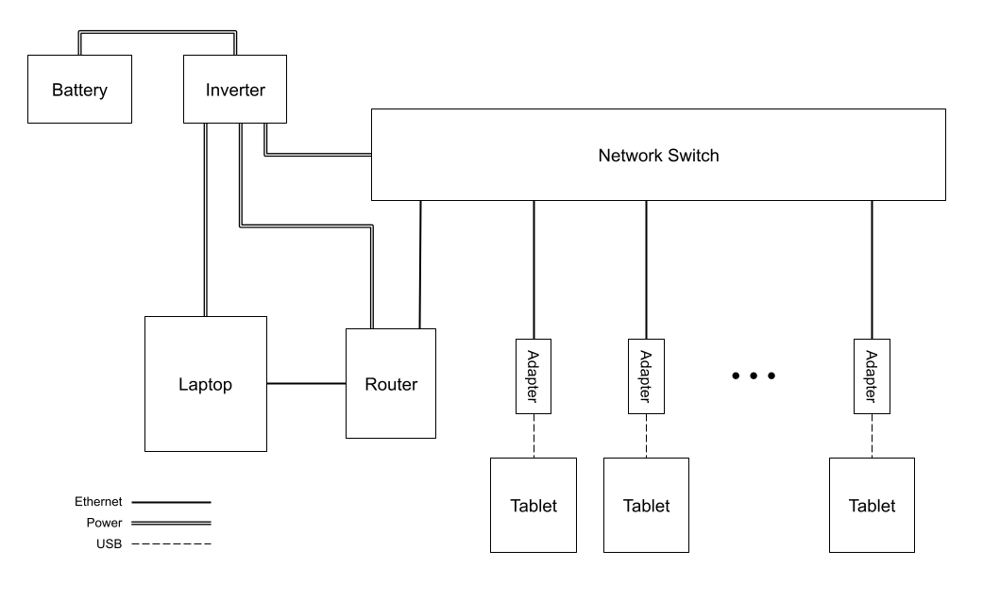

# How to set up 

## A. Plug in everything

Set up the cables and tablets as below.



## B. Start backend

1. Start the docker container.
    a. Open Docker Desktop
    b. Under "Containers", find the container titled "hueneme_db"
    c. Press the play button on it

2. Start the backend

```bash
cd BackendServer
python main.py
```
